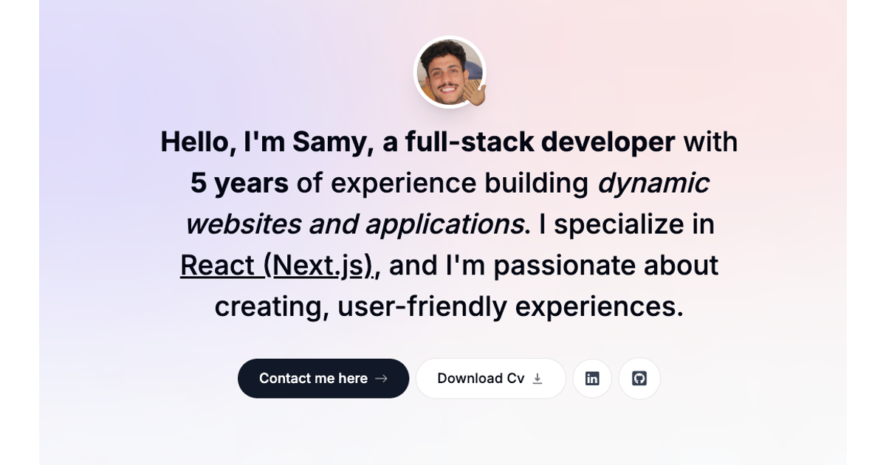

<h1 align="center">👋 Hi, I'm Samy Ali Sánchez</h1>
<h3 align="center">Frontend Developer | Passionate about design, animation, and building clean web experiences</h3>

---

🚀 This repository contains the source code for my **personal portfolio website**, built using modern frontend tools like **React**, **TypeScript**, and **TailwindCSS**.

🔗 **Live demo:** [samyalisanchez.dev](https://yourdomain.com) <!-- Replace with your actual portfolio link -->

---

## 🛠️ Tech Stack

- ⚛️ React + Vite
- 💅 TailwindCSS
- 🎨 Framer Motion (smooth animations)
- 🧠 Custom React Hooks (TypeScript)

---

## 🖼️ Preview

<!-- You can include a screenshot or gif of your site -->

  

---

## 📁 Project Structure

- `components/` – Reusable UI components
- `lib/hooks.ts` – Custom hooks for clean logic
- `sections/` – Main layout sections (hero, about, experience, etc.)
- `public/CV.pdf` – My updated resume
- `public/assets/` – Static files and images

---

## 📬 Get in Touch

I'm open to job opportunities, freelance projects, or simply connecting with fellow devs and designers.

- [📧 Email Me](mailto:samy.alisanchez91@gmail.com)
- [💼 Connect on LinkedIn](https://linkedin.com/in/samyalisanchez)

If you like this project, feel free to **give it a ⭐** — it really helps!

---

Thanks for visiting! ✨

